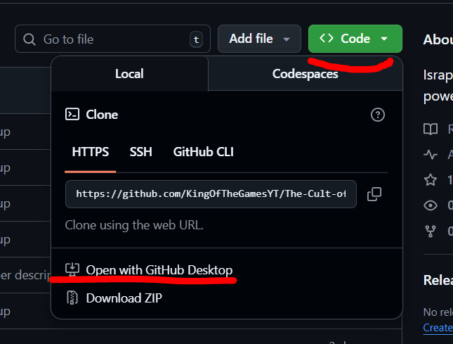
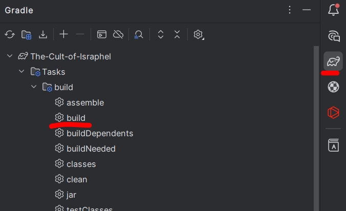

# The Cult of Israphel
Just a mod that randomnizes all vanilla dungeon spawners

Israphel and his army return with new powers and expanded presence

The license is ARR

- You can not claim this mod as your own
- Please report any bugs you experience by using this
- You may make videos on it
- You may use it in modpacks

If you wish to build the code on here for personal use or to contribute to the project then follow these steps 

- Download [Intelij](https://www.jetbrains.com/idea/download/?section=windows)
- Then Download  [Github Desktop](https://desktop.github.com/download/)
- Once you've downloaded that, 
- Then wait for it to fetch the code with Github desktop
- Then select the branch you want
- Then click Repository at the top 
- Then go to Show In explorer
- Then right click the build.gradle file and click open in Intelij
- Then wait for the gradle to import
- Then you can click this 
- Then your build will be in the build folder